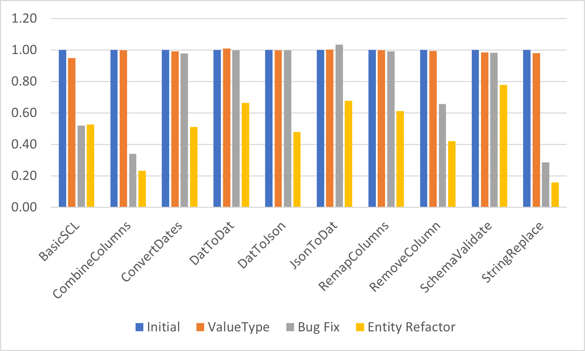

# Performance Improvements at Reductech

The focus for Sequence release v0.18.0 has been on performance.
This post explains the changes we've made,
how they've improved performance, and why we decided to implement them.
This is aimed at both _SCL_ users and _C#_ developers who are interested in performance.

<!--truncate-->

## What is SCL

Sequence Configuration Language (SCL) is a programming language for forensic and ediscovery technicians.
The typical use case involves reading, writing, and manipulating large amounts of data so performance is critical.
The language is implemented in _C#_ so performance improvements are achieved by optimizing _C#_ code.

## Measuring Performance

Before we improve performance we need to measure it. This means benchmarking.
I created a new console project and added the excellent
[benchmark dot net](https://benchmarkdotnet.org/articles/overview.html) package to it.

As we want to optimize real world performance I found some real world data to run the benchmarks on.
This data is a 1MB concordance file (very similar to a CSV) with 1000 rows and 44 columns.
The data comes from the _ENRON_ dataset but nevertheless I was very careful to add it to
`.gitignore` and not commit it to the open source repository.

I wrote several _SCL_ scripts representing different workflows.
For example this script removes a column from the data:

```scl
- <path> = PathCombine ['Data', 'TestData.dat']
- FileRead <path>
| FromConcordance
| EntityMap (EntityRemoveProperty  <> Property: "Custodian" )
| ToConcordance
| StringLength
```

Note that `StringLength` at the end. This is to ensure that the stream of concordance data
is read to the end (and therefore all of the data is converted to concordance).
In a real world scenario one would probably write the data to a file or send it across
the internet but doing that would make the benchmarks a lot more fiddly and
the code that writes to a file is outside my control anyway so there is not much point in benchmarking it.

## Benchmarks

Here is a summary of all the benchmarks and the initial results, running on a 12th gen Intel i7 CPU on _Windows_.

| **Name**       | **Summary**                                                                                                               | **Mean / μs** | **Error / μs** | **Standard Deviation / μs** |
| :------------- | :------------------------------------------------------------------------------------------------------------------------ | :-----------: | :------------: | :-------------------------: |
| BasicSCL       | Prints 'Hello World'                                                                                                      |     68.11     |     1.327      |            1.363            |
| CombineColumns | Reads a concordance file, adds a new column by combining two existing ones, and converts it back to concordance           |  306,342.04   |   2,856.823    |          2,385.576          |
| ConvertDates   | Reads a concordance file, converts dates to a different representation, and converts it back to concordance               |  121,637.43   |   1,641.555    |          1,535.512          |
| DatToDat       | Reads a concordance file, and converts it back to concordance                                                             |   92,824.18   |    810.059     |           718.096           |
| DatToJson      | Reads a concordance file, and converts it json                                                                            |   86,831.86   |   1,723.177    |          2,471.330          |
| JsonToDat      | Reads a json file and converts it to concordance                                                                          |   74,657.57   |   1,249.805    |          1,169.068          |
| RemapColumns   | Reads a concordance file, renames one of the columns, and converts it back to concordance                                 |   98,585.92   |   1,902.414    |          2,035.561          |
| RemoveColumn   | Reads a concordance file, removes one of the columns, and converts it back to concordance                                 |  149,538.83   |   1,581.342    |          1,479.188          |
| SchemaValidate | Reads a concordance file, confirms that all rows conform to a particular json schema, and converts it back to concordance |  133,736.27   |    793.008     |           702.981           |
| StringReplace  | Reads a concordance file, performs some string replacements on each row, and converts it to json                          |  335,875.11   |   4,519.005    |          4,227.080          |

Note that all times are in microseconds, so the longest sequences are taking about one third of a second.

## Performance Improvements

### Replacing `Task` with `ValueTask`

_SCL_ steps all have a `Run` method which returns the result wrapped in a `Task`.
One of the performance optimizations I was eager to try was wrapping the result in a `ValueTask` instead.
This should reduce the number of heap allocations per step by one and
I was expecting a small performance improvement for sequences which run cheap steps inside a loop.

The tradeoff is that there are some things you can do with a `Task` but not with a `ValueTask`
such as awaiting them multiple times. Fortunately the `Run` method was only being used
in a few places and I was able to easily check that none of the missing functionality was being used.

The results of this update:

| **Name**       | **Initial / μs** | **After ValueTask / μs** |  **Ratio**  |
| :------------- | :--------------: | :----------------------: | :---------: |
| BasicSCL       |      68.11       |          64.56           | 0.947878432 |
| CombineColumns |    306,342.04    |        306,125.29        | 0.999292458 |
| ConvertDates   |    121,637.43    |        120,553.24        | 0.991086707 |
| DatToDat       |    92,824.18     |        93,733.29         | 1.009793892 |
| DatToJson      |    86,831.86     |        86,622.87         | 0.997593165 |
| JsonToDat      |    74,657.57     |        74,910.93         | 1.003393628 |
| RemapColumns   |    98,585.92     |        98,365.44         | 0.997763575 |
| RemoveColumn   |    149,538.83    |        148,584.52        | 0.993618313 |
| SchemaValidate |    133,736.27    |        131,679.90        | 0.984623693 |
| StringReplace  |    335,875.11    |        328,927.93        | 0.979316181 |

### Finding a Bug

A 2% performance improvement on the slowest benchmark was nice but I was actually
hoping for a larger improvement. The StringReplace sequence was taking about three
times as long as the ConvertDates sequence despite doing what seemed like a lot less work.

I thought that the reason might be that `StringReplace` converts the data at the end
into JSON rather that concordance like most of the other benchmarks.
I chose to do this initially because I wanted to make sure that performing an action
on the data first didn't make the conversion to JSON slower.
At this stage I wrote additional benchmarks to check if that was what was happening.
It wasn't - converting to JSON was consistently ~6000μs faster than converting to
concordance across the board.

Thinking again, I thought the difference might be down to the fixed cost of running a step.
ConvertDates uses the `Transform` step which applies a JSON schema to every step in
an entity stream whereas StringReplace is using the `ArrayMap` step to call the
`StringReplace` step on every entity in the stream.
This means that the StringReplace sequence is running about 1000 very cheap steps
where ConvertDates is calling one very expensive step.

I decided to use the Visual Studio performance profiler to try and find out what was going on.
I stared by using the CPU usage tool as I thought the CPU was the most likely performance bottleneck.

I discovered that a lot of time was being spent in the `IRunnableStep<T>.Run` method.
This is not unexpected but what was unexpected was that it was spending almost three
times as long in there as in the `CompoundStep<T>.Run` method despite it having been
designed as a thin wrapper around that method which exists purely to enable logging.

Looking at the method code I immediately spotted the problem:

```csharp
async Task<Result<T, IError>> IRunnableStep<T>.Run(IStateMonad stateMonad, CancellationToken cancellationToken)
{
    using (stateMonad.Logger.BeginScope(Name))
    {
        object[] GetEnterStepArgs()
        {
            var properties = AllProperties
                .ToDictionary(x => x.Name, x => x.Serialize(SerializeOptions.SanitizedName));

            return new object[] { Name, properties };
        }

        LogSituation.EnterStep.Log(stateMonad, this, GetEnterStepArgs());

        var result = await Run(stateMonad, cancellationToken);

        if (result.IsFailure)
        {
            LogSituation.ExitStepFailure.Log(stateMonad, this, Name, result.Error.AsString);
        }
        else
        {
            var resultValue = result.Value.Serialize(SerializeOptions.SanitizedName);

            LogSituation.ExitStepSuccess.Log(stateMonad, this, Name, resultValue);
        }

        return result;
    }
}
```

The EnterStep arguments are being created - using an expensive dictionary - every time the step is run,
regardless of the logging level (they should only be logged if the log level is `Trace` and the benchmarks are using `Info`).
Clearly what happened was that the `LogSituation.EnterStep.Log` method once took a `Func<object[]>`
but was refactored to use an `object[]` at some point and I missed the performance implications
when updating this invocation.

I fixed the code and also checked other invocations of the method to make sure I wasn't
making the same mistake somewhere else (I wasn't). Then I ran the benchmarks again:

| **Name**       | **After ValueTask** | **After EnterStep Fix** |  **Ratio**  |
| :------------- | :-----------------: | :---------------------: | :---------: |
| BasicSCL       |        64.56        |          35.39          | 0.548172243 |
| CombineColumns |     306,125.29      |       103,820.13        | 0.339142611 |
| ConvertDates   |     120,553.24      |       119,108.53        |  0.988016   |
| DatToDat       |      93,733.29      |        92,621.39        | 0.988137619 |
| DatToJson      |      86,622.87      |        86,615.62        | 0.999916304 |
| JsonToDat      |      74,910.93      |        77,218.89        | 1.030809389 |
| RemapColumns   |      98,365.44      |        97,755.47        | 0.99379894  |
| RemoveColumn   |     148,584.52      |        98,192.86        | 0.660855249 |
| SchemaValidate |     131,679.90      |       131,270.77        | 0.996892996 |
| StringReplace  |     328,927.93      |        95,778.85        | 0.291184911 |

The three benchmarks which run steps in a loop all got a lot faster, and the BasicSCL sequence
got almost twice as fast. This just goes to show that finding and fixing performance bugs
is often massively more effective than micro-optimizing heap allocations.

### Rearchitecting Entities

The other way to get big performance wins is to use the right collections in the right
places. _SCL_ has the type `entity` which is used to represent data. It's a key-value or
property-value container, similar to a javascript object. The most obvious way to represent
this in C# was to use a `Dictionary<String, Object>` and that was essentially how the `Entity` type was
implemented - though using the SCL-friendly types `StringStream` and `ISCLObject` instead.
I wanted to try a different implementation using two `ImmutableArray`s instead.
`ImmutableArray` is an extremely thin wrapper around an array and has exactly the same performance characteristics.

I refactored the `entity` type to use an `ImmutableArray<StringStream>` for the property names
and `ImmutableArray<ISCLObject>` for the values. I made them private to ensure that they would
always be kept in sync. I updated the implementations of all the `entity` methods but not the signatures.
Keeping the interface the same meant that the refactor was very smooth and I hardly had to
change any code outside the `entity` class.

Making this change also allowed me to sneak in a few other performance optimizations.
When creating entities from a consistent data structure (such as a CSV file or a SQL table)
I could let all the entities share the same headers collection.
Note that this would have been a bad idea if I had used a regular rather than immutable array.

I ran the benchmarks again and compared to the previous results:

| **Name**       | **After EnterStep fix** | **After Entity Refactor** | **Change**  |
| :------------- | :---------------------: | :-----------------------: | :---------: |
| BasicSCL       |          35.39          |           35.81           | 1.011867759 |
| CombineColumns |       103,820.13        |         70,840.40         | 0.682337809 |
| ConvertDates   |       119,108.53        |         62,156.69         | 0.521849191 |
| DatToDat       |        92,621.39        |         61,528.62         | 0.66430249  |
| DatToJson      |        86,615.62        |         41,558.64         | 0.479805375 |
| JsonToDat      |        77,218.89        |         50,542.41         | 0.654534273 |
| RemapColumns   |        97,755.47        |         60,397.03         | 0.617837856 |
| RemoveColumn   |        98,192.86        |         62,817.56         | 0.639736535 |
| SchemaValidate |       131,270.77        |        104,101.35         | 0.793027648 |
| StringReplace  |        95,778.85        |         52,792.74         | 0.551194131 |

This change almost :exclamation: **doubled** :exclamation: performance across the board
(note that the BasicSCL sequence does not use entities). I was very happy.

The table and charts below show the complete journey.
Some of the steps were now several times as fast and this difference would likely be
magnified in real world scenarios that perform multiple transformations since
the costs of reading the file and converting between data formats are fixed.

| **Name**       | **Initial** | **After ValueTask** | **Change**  | **After EnterStep fix** | **Change**  | **After Entity Refactor** | **Change**  | **Total Change** |
| :------------- | :---------: | :-----------------: | :---------: | :---------------------: | :---------: | :-----------------------: | :---------: | :--------------: |
| BasicSCL       |    68.11    |        64.56        | 0.947878432 |          35.39          | 0.548172243 |           35.81           | 1.011867759 |   0.525767141    |
| CombineColumns | 306,342.04  |     306,125.29      | 0.999292458 |       103,820.13        | 0.339142611 |         70,840.40         | 0.682337809 |   0.231246093    |
| ConvertDates   | 121,637.43  |     120,553.24      | 0.991086707 |       119,108.53        |  0.988016   |         62,156.69         | 0.521849191 |   0.510999698    |
| DatToDat       |  92,824.18  |      93,733.29      | 1.009793892 |        92,621.39        | 0.988137619 |         61,528.62         | 0.66430249  |    0.66285121    |
| DatToJson      |  86,831.86  |      86,622.87      | 0.997593165 |        86,615.62        | 0.999916304 |         41,558.64         | 0.479805375 |   0.478610501    |
| JsonToDat      |  74,657.57  |      74,910.93      | 1.003393628 |        77,218.89        | 1.030809389 |         50,542.41         | 0.654534273 |   0.676989755    |
| RemapColumns   |  98,585.92  |      98,365.44      | 0.997763575 |        97,755.47        | 0.99379894  |         60,397.03         | 0.617837856 |   0.612633427    |
| RemoveColumn   | 149,538.83  |     148,584.52      | 0.993618313 |        98,192.86        | 0.660855249 |         62,817.56         | 0.639736535 |   0.420075241    |
| SchemaValidate | 133,736.27  |     131,679.90      | 0.984623693 |       131,270.77        | 0.996892996 |        104,101.35         | 0.793027648 |   0.778407757    |
| StringReplace  | 335,875.11  |     328,927.93      | 0.979316181 |        95,778.85        | 0.291184911 |         52,792.74         | 0.551194131 |   0.157179673    |



## Takeaways

The top takeaways from this project are:

- Fixing bugs is often the best way to improve performance
- Dictionaries are slow - plain old arrays are often faster even when
  a `Dictionary` or `Hashmap` is the "theoretically" correct choice.
- Refactoring can be easier than you expect, especially if the code you
  are changing is well insulated and the API to that code remains consistent.

One final thing - even though the `ValueTask` update only showed a very small improvement initially,
that improvement was orthogonal to the other improvements. It shaved 5ms off the initial StringReplace
benchmark and once I had completed the other improvements I tried reverting just the `ValueTask`
changes and running the benchmarks again.
StringReplace was now about 5ms slower. Had I done this change last instead of first it would
have looked like an 8% improvement instead of a 2% one.
This shows the value of **small incremental improvements**.
Sometimes they don't just add up - they multiply!
